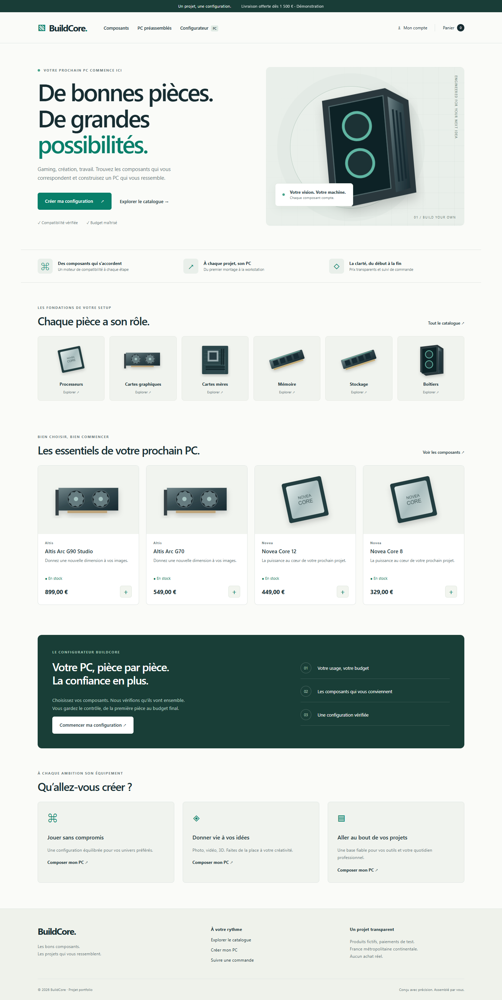

# BuildCore

**Les bons composants. Votre configuration.**

BuildCore est une boutique de matériel informatique et un configurateur de PC, réalisés en Symfony et Angular. Le projet illustre les contraintes d’un e-commerce : compatibilité technique, stock concurrent, snapshots de commande, sessions, paiements idempotents et traitements asynchrones.

Les profils gaming, création, développement, bureautique et workstation orientent le parcours. Ils ne promettent aucun benchmark ni niveau de performance. Les 26 produits et les marques sont fictifs ; les illustrations SVG sont originales. **Aucun paiement réel n’est autorisé.**



## État et périmètre

La boutique, le catalogue filtré et paginé, les fiches, le configurateur, le panier, les comptes, les adresses, les commandes et le back-office sont implémentés. Les tests réellement exécutés et les limites sont consignés dans [docs/status.md](docs/status.md). La configuration Docker et la CI ne sont pas présentées comme validées tant qu’elles n’ont pas été exécutées dans leur environnement cible.

## Architecture et technologies

- Monorepo : `apps/api`, `apps/storefront`, `infrastructure`, `docs`.
- PHP **8.4**, Symfony **7.4 LTS**, Doctrine ORM, PostgreSQL 17.
- Symfony Security, Validator, Serializer, Workflow, Messenger, Mailer, Mercure.
- Angular **21**, Node.js **24**, TypeScript strict, composants autonomes, routes différées, signaux, RxJS, formulaires réactifs et SCSS.
- PHPUnit 11, PHPStan niveau 6, PHP CS Fixer, Vitest, ESLint, Prettier et Playwright.
- Redis pour les sessions du conteneur avec verrouillage natif ; PostgreSQL pour Messenger et les transactions métier.

Le backend est un monolithe modulaire : Catalog, Compatibility, Cart, Inventory, Checkout, Order, Payment, Customer, Administration, Notification et Shared. L’identité affichée est centralisée dans `apps/storefront/src/app/core/brand.ts`. Les URLs techniques Mercure sont des identifiants stables, indépendants du domaine public.

## Choisir un mode de lancement

Toutes les commandes PowerShell ci-dessous partent de `C:\DEV\buildcore`. Exécutez chaque étape dans l’ordre et arrêtez-vous si elle échoue. **Choisissez le mode natif ou Docker ; ne lancez pas les deux API en même temps.**

- **Sur cette machine : mode natif**, déjà installé et vérifié. Docker n’est pas installé. Pour un simple redémarrage, allez directement à « Lancement quotidien ».
- **Mode Docker** : nécessite Docker Desktop démarré avec les conteneurs Linux et Compose v2. Les fichiers sont fournis, mais leur exécution Docker n’a pas été vérifiée ici.

Node 24 et npm sont requis dans les deux modes. Le mode natif exige Composer 2 et PHP 8.4 avec PDO SQLite (mode léger) ou PDO PostgreSQL, mbstring, intl, XML, curl, OpenSSL, fileinfo et zip. PostgreSQL reste la base cible.

## Installation ou réinstallation native

Arrêtez les serveurs avant de réinstaller les dépendances. Sur Windows, Angular conserve `esbuild.exe` ouvert et empêche `npm ci` de le remplacer.

```powershell
Set-Location C:\DEV\buildcore
./scripts/stop-local.ps1
# Sur cette machine uniquement : PHP 8.4 portable déjà présent.
$env:PATH = "$PWD\.tools\php84;" + $env:PATH
php --version
node --version
composer --version
```

Vérifiez PHP **8.4 ou supérieur** et Node **24** avant de continuer. Sur une autre machine, installez PHP 8.4 et configurez son PATH ; `.tools` n’est pas distribué avec Git. Le réglage du PATH ci-dessus doit être répété dans chaque nouveau terminal qui exécute `php` ou `composer`.

Pour le mode léger SQLite :

```powershell
if (!(Test-Path apps/api/.env.local)) {
    Copy-Item apps/api/.env.sqlite.example apps/api/.env.local
}
composer install --working-dir=apps/api
npm ci --prefix apps/storefront
php apps/api/bin/console doctrine:migrations:migrate --no-interaction
php apps/api/bin/console app:fixtures
php apps/api/bin/console messenger:setup-transports
php apps/api/bin/console doctrine:schema:validate
```

Ces commandes conservent le fichier `.env.local` existant, les secrets et les données. Si ce fichier existe déjà, vérifiez son `DATABASE_URL` avant les migrations. Pour utiliser votre PostgreSQL, créez une base dédiée et configurez cette URL à partir de `apps/api/.env.example`. Les tests PostgreSQL portables de cette machine sont décrits dans [integration.md](docs/integration.md).

## Lancement quotidien (natif, Windows)

Une fois les dépendances et la base préparées, **inutile de relancer `npm ci` à chaque démarrage** :

```powershell
Set-Location C:\DEV\buildcore
./scripts/start-local.ps1
```

Le script choisit le PHP portable s’il existe, sinon celui du PATH. Il vérifie les versions, les dépendances et les ports, puis attend que l’API et Angular répondent avant d’annoncer les URLs. Les journaux sont dans `.cache`.

Pour arrêter ou redémarrer :

```powershell
./scripts/stop-local.ps1
./scripts/start-local.ps1
```

Pour réinstaller uniquement le frontend :

```powershell
./scripts/stop-local.ps1 -FrontendOnly
npm ci --prefix apps/storefront
npm --prefix apps/storefront start -- --host 127.0.0.1
```

La dernière commande reste au premier plan ; `Ctrl+C` l’arrête. N’exécutez pas aussi `start-local.ps1` pendant qu’elle tourne. `stop-local.ps1` cible les processus identifiables de BuildCore ; il ne ferme pas tous les processus Node du PC. PostgreSQL, Mailpit et Mercure restent actifs.

Alternative manuelle au script : dans un terminal avec PHP 8.4, lancer `php -S 127.0.0.1:8000 -t apps/api/public apps/api/public/index.php` ; dans un second, lancer `npm --prefix apps/storefront start -- --host 127.0.0.1`. Le serveur PHP intégré est réservé au développement.

## Services optionnels en mode natif

Le catalogue, les comptes et le configurateur fonctionnent sans Mailpit ou Mercure. `MAILER_DSN=null://null` désactive l’envoi d’emails ; le suivi utilise son rafraîchissement périodique si le hub est absent. Stripe exige ses clés test.

Sur cette machine, `./scripts/start-services.ps1` réutilise les binaires portables déjà préparés pour démarrer PostgreSQL de test, Mailpit et Mercure. Ce script ne télécharge ni n’installe ces binaires sur une nouvelle machine. Voir [les intégrations locales](docs/integration.md), notamment pour lancer le worker SMTP.

## Installation avec Docker (alternative au mode natif)

Arrêtez l’API et Angular natifs avec `./scripts/stop-local.ps1`, puis les services portables de ce projet avec `./scripts/stop-services.ps1` avant de lancer les conteneurs : les ports 1025, 8025 et 3000 sont partagés. Les données sont conservées. N’arrêtez aucun programme inconnu uniquement pour libérer un port.

```powershell
docker --version
docker compose version
docker info
```

Si une commande échoue, installez/démarrez Docker Desktop avant la suite. Puis :

```powershell
if (!(Test-Path .env)) { Copy-Item .env.example .env }
npm ci --prefix apps/storefront
docker compose config --quiet
docker compose up -d --build postgres redis mercure mailpit api
docker compose exec api php bin/console doctrine:migrations:migrate --no-interaction
docker compose exec api php bin/console app:fixtures
docker compose exec api php bin/console messenger:setup-transports
docker compose --profile workers up -d --build worker scheduler
docker compose --profile workers ps
npm --prefix apps/storefront start -- --host 127.0.0.1
```

En mode Docker, exécutez les commandes Symfony avec `docker compose exec api` ; le PHP natif et son `.env.local` ne ciblent pas nécessairement la même base. Le worker et le scheduler démarrent après les migrations. Le worker redémarre aussi après sa limite normale d’une heure. Pour arrêter les conteneurs en conservant les données : `docker compose --profile workers stop`. Ne supprimez pas les volumes pour une mise à jour ordinaire. Après une modification de code backend ou de secrets Compose, reconstruisez/recréez `api`, `worker` et `scheduler`.

## URLs locales

| Service | URL |
|---|---|
| Boutique | http://127.0.0.1:4200 |
| Configurateur | http://127.0.0.1:4200/configurateur |
| Administration | http://127.0.0.1:4200/admin |
| API | http://127.0.0.1:8000/api/v1/products |
| Explorateur API | http://127.0.0.1:8000/api/docs |
| OpenAPI | http://127.0.0.1:8000/api/v1/openapi.json |
| Mailpit, si démarré | http://127.0.0.1:8025 |
| Mercure, si démarré | http://127.0.0.1:3000/.well-known/mercure |

Utilisez `127.0.0.1` pendant toute la session, y compris dans `APP_ORIGIN` pour le retour Stripe. Passer à `localhost` change l’hôte des cookies. Angular proxifie `/api` et `/.well-known/mercure` pour conserver une même origine. Une visite directe du hub sans cookie autorisé peut renvoyer 401 : ce n’est pas une erreur de démarrage.

## Variables d’environnement

Les valeurs publiques de développement sont dans `apps/api/.env`. Les secrets locaux restent dans `apps/api/.env.local`, ou dans le `.env` racine pour Compose. Les variables du processus prennent priorité. Docker exclut tous les fichiers `.env.local`.

| Variable | Rôle |
|---|---|
| `APP_SECRET` | Secret Symfony, à remplacer hors développement |
| `APP_ORIGIN` | Origine du frontend pour le retour Stripe |
| `DATABASE_URL` | Connexion PostgreSQL ou SQLite local |
| `MESSENGER_TRANSPORT_DSN` | Transport Doctrine, `auto_setup=0` |
| `MAILER_DSN` | SMTP Mailpit, ou `null://null` sans envoi |
| `MERCURE_URL` | URL interne du hub |
| `MERCURE_PUBLIC_URL` | URL publique sous l’origine du frontend |
| `MERCURE_JWT_SECRET` | Clé du hub et de l’API |
| `STRIPE_SECRET_KEY` | Clé `sk_test_…`, toute clé live est refusée |
| `STRIPE_WEBHOOK_SECRET` | Secret d’écoute Stripe CLI |

## Comptes de démonstration

Mot de passe commun : **`BuildCore-Demo-2026!`**.

| Email | Rôle |
|---|---|
| `admin@buildcore.test` | Administrateur et client |
| `alice@buildcore.test` | Client |
| `thomas@buildcore.test` | Client distinct pour tester les permissions |

Ces comptes ne doivent jamais être utilisés en production. `app:fixtures` est refusé en environnement `prod`. Les fixtures sont additives : elles n’effacent pas vos données.

## Parcours disponibles

Le catalogue propose recherche, catégorie, marque, stock, prix, tri, pagination et filtre technique exact dépendant de la catégorie. Les paramètres sont conservés dans l’URL. La fiche affiche caractéristiques, SKU, disponibilité, quantité et produits proches.

Le configurateur vérifie socket, mémoire, slots et capacité, format de carte mère, longueur GPU, format et puissance de l’alimentation, refroidissement, stockage, composants manquants et disponibilité. Il distingue erreurs, avertissements et informations. Le serveur valide de nouveau avant sauvegarde et ajout groupé au panier.

Le panier invité vit dans la session serveur. À la connexion, les quantités sont additionnées et plafonnées à dix par référence ; elles restent soumises au stock et aux prix courants. Le tunnel prend une adresse et un mode standard ou express, puis crée la session Stripe test. Livraison limitée à la France métropolitaine continentale : Corse et outre-mer exclus de cette démonstration.

L’espace client comprend profil, adresses, changement de mot de passe, configurations et suivi des commandes. L’administration permet création, modification, publication, archivage, variantes commerciales, import d’images, ajustements de stock tracés, préparation, expédition, livraison et remboursement total test.

## Stripe test et webhooks

```text
stripe login
stripe listen --forward-to 127.0.0.1:8000/api/v1/payments/webhook
```

Installez Stripe CLI avant ces commandes. Placez la clé test et le secret `whsec_…` affiché par Stripe CLI dans `apps/api/.env.local` en natif, ou dans `.env` à la racine pour Docker. Gardez `stripe listen` ouvert dans son terminal. Relancez les processus natifs ou recréez les conteneurs concernés après modification des secrets. Ouvrez une commande depuis Angular. Utilisez uniquement les moyens de paiement de test documentés par Stripe.

Le backend recalcule les prix, crée les snapshots et réserve le stock en transaction. La création Stripe utilise une clé idempotente liée à la commande et s’effectue hors de la transaction. Le webhook signé confirme le paiement ; le retour navigateur ne le confirme jamais. Un événement dupliqué ne vend ni ne libère deux fois le stock.

Les lignes attendues du récapitulatif sont comparées aux prix et quantités courants. Un changement renvoie `QUOTE_CHANGED`, annule toute réservation de cette tentative et oblige le client à vérifier le récapitulatif actualisé avant de confirmer à nouveau.

La réservation est fixée à environ 35 minutes pour laisser une marge par rapport au minimum de 30 minutes imposé par Stripe. Une réponse réseau perdue est rapprochée via la métadonnée de commande. En cas d’incertitude ou de panne Stripe, la libération doit attendre un rapprochement fiable. Les remboursements sont uniquement intégraux et confirmés par webhook ; les retours physiques exigent un ajustement de stock explicite.

## Workers, emails et temps réel

En natif, dans un terminal dédié depuis la racine, avec PHP 8.4 et Mailpit/Mercure démarrés :

```powershell
$env:MAILER_DSN = 'smtp://127.0.0.1:1025'
php apps/api/bin/console messenger:consume async emails realtime --time-limit=3600
```

Ce terminal reste occupé jusqu’à l’arrêt du worker. Exécutez les commandes ponctuelles dans **un autre terminal** :

```powershell
php apps/api/bin/console app:reservations:expire
php apps/api/bin/console app:stock:alert
php apps/api/bin/console messenger:failed:show
```

`messenger:failed:retry` sert à rejouer des échecs après correction de leur cause ; ce n’est pas une étape de démarrage. En Docker, le service `worker` remplace le worker natif et les commandes ponctuelles passent par `docker compose exec api php bin/console …`.

Planifiez l’expiration chaque minute (le service Compose `scheduler` le fait). Les files email et Mercure sont distinctes avec cinq tentatives et un transport d’échec. Le paiement et l’écriture des messages partagent la transaction PostgreSQL. Une panne de notification n’annule pas un paiement.

Le hub reçoit des publications privées par commande. Le cookie d’abonnement n’est émis qu’après le Voter propriétaire/administrateur. Le frontend recharge le détail sur événement et toutes les quinze secondes en repli, avec un bouton manuel. Les événements ne contiennent ni adresse ni email.

Les alertes de stock utilisent le seuil de chaque variante et `STOCK_ALERT_EMAIL` (par défaut `admin@buildcore.test`). Elles sont recontrôlées à l’envoi et dédupliquées par référence et jour UTC. Les configurations du panier conservent leur nom et peuvent être modifiées ou retirées ensemble.

## Tests et qualité

Ces commandes utilisent PHP 8.4 et les dépendances installées. Les tests utilisent SQLite dans `var/test.db` par défaut ; un `DATABASE_URL` défini dans le terminal prend priorité. Ne les dirigez jamais vers une base contenant des commandes réelles. Pour PostgreSQL isolé, voir [integration.md](docs/integration.md).

```powershell
php apps/api/bin/console doctrine:migrations:migrate --env=test --no-interaction
php apps/api/bin/console app:fixtures --env=test
php apps/api/vendor/bin/phpunit -c apps/api/phpunit.xml.dist
php apps/api/vendor/bin/phpstan analyse -c apps/api/phpstan.neon --memory-limit=512M
php apps/api/vendor/bin/php-cs-fixer fix --config=apps/api/.php-cs-fixer.dist.php --dry-run --diff
npm --prefix apps/storefront run lint
npm --prefix apps/storefront run format:check
npm --prefix apps/storefront test
npm --prefix apps/storefront run build
```

Après démarrage de l’API et d’Angular :

```powershell
Push-Location apps/storefront
npx playwright install chromium
Pop-Location
npm --prefix apps/storefront run e2e
```

Sur cette machine, les vérifications utilisent Chrome déjà installé : `$env:PLAYWRIGHT_CHROMIUM_EXECUTABLE = 'C:\Program Files\Google\Chrome\Application\chrome.exe'`, puis `npm --prefix apps/storefront run e2e`. Cela remplace l’installation de Chromium ci-dessus. Les parcours E2E utilisent les comptes et fixtures de démonstration et supposent Stripe non configuré pour le scénario d’indisponibilité. La CI est configurée pour PHPUnit sur PostgreSQL et le frontend sur Node 24 ; aucune exécution distante n’est revendiquée.

## Documentation

- [Audit des commandes de lancement](docs/startup-audit.md)
- [Compte rendu de livraison](docs/delivery.md)
- [Architecture](docs/architecture.md) et [modèle métier](docs/domain-model.md)
- [Compatibilité](docs/compatibility-engine.md)
- [Workflow](docs/order-workflow.md) et [paiement](docs/payment-flow.md)
- [Stock et réservations](docs/inventory-reservations.md)
- [Sécurité](docs/security.md)
- [Résultats et limites](docs/status.md)
- [Tests réels PostgreSQL, Mailpit et Mercure](docs/integration.md)
- [Quinze notions d’entretien](docs/interview.md)

## Limites et évolutions

Cette version est une démonstration, pas une boutique prête à encaisser des paiements réels. Les limites détaillées sont suivies dans `docs/status.md`. PostgreSQL, SMTP et le suivi Mercure ont été vérifiés localement. Restent notamment la validation de l’infrastructure Docker/Redis, les scénarios Stripe CLI, des filtres techniques plus riches et une revue d’accessibilité approfondie.

Aucun service de marketplace, livraison internationale, recommandation IA, benchmark inventé ou chat vidéo n’est inclus. Licence [MIT](LICENSE).

## Dépannage Windows : EPERM sur esbuild.exe

`npm ci` remplace `node_modules`. Il échoue si Angular, un build en surveillance ou un test conserve `esbuild.exe` ouvert. Arrêtez d’abord le frontend :

```powershell
./scripts/stop-local.ps1 -FrontendOnly
npm ci --prefix apps/storefront
npm --prefix apps/storefront start -- --host 127.0.0.1
```

Ce cas a été reproduit le 30 septembre 2026 : l’ancien serveur Angular lancé en arrière-plan détenait le fichier ; après son arrêt, `npm ci` a réussi. Il n’a pas été nécessaire de supprimer le lockfile, vider le cache npm ou exécuter npm administrateur. Si le verrou persiste, fermez le terminal d’un éventuel build/test en surveillance et identifiez le processus utilisant le fichier avant toute autre intervention.
