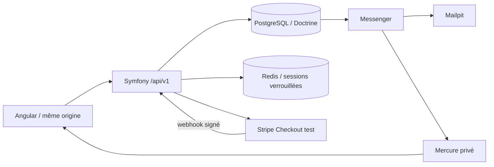

# Architecture

BuildCore est un monolithe Symfony modulaire avec un client Angular. Une transaction PostgreSQL peut couvrir commande, stock, reçu Stripe et messages Messenger : les découper en microservices créerait ici un coût sans bénéfice.

Les contrôleurs adaptent HTTP et appliquent les permissions. `CatalogService` réalise les lectures, `CompatibilityEngine` porte les règles pures, `CartService` gère session et compte, `CheckoutService` orchestre la réservation, `InventoryService` protège les invariants, `PaymentService` traite les événements et `OrderWorkflow` applique les transitions.

Doctrine matérialise les snapshots de commande en JSON. Le stock est modifié par SQL conditionnel et transactions. Les lectures catalogue joignent variante et produit pour éviter une requête par carte. Les filtres restent paramétrés. Les index couvrent catégorie/statut, expiration des réservations et historique des ajustements.

Les routes Angular sont chargées à la demande. `Api` encapsule HttpClient, le renouvellement CSRF et les erreurs lisibles. Les signaux portent l’état local ; RxJS suit les paramètres de route et le rafraîchissement du suivi. Le frontend n’est jamais l’autorité sur les prix ou les permissions.

Le premier moteur de recherche reste relationnel (`LIKE` insensible à la casse et extraction JSON pour le filtre technique). `CatalogService` est la frontière à extraire en interface si un deuxième moteur apparaît. Il n’y a pas d’Elasticsearch ni de cache catalogue invalidable à maintenir.

Les choix de simplification assumés : marques/catégories codées, adresses et configurations stockées comme agrégats JSON, gestion de stock avec SQL explicite au sein de Doctrine. Ils sont à faire évoluer lorsque les usages le justifient.
