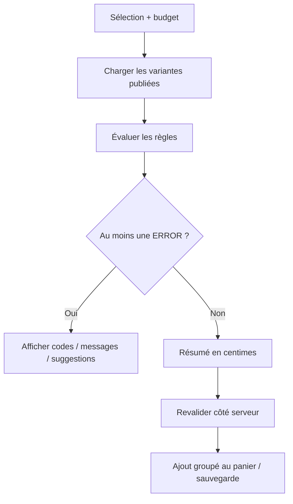

# Moteur de compatibilité

Le moteur est pur : il prend des variantes chargées par le serveur, retourne des diagnostics et ne modifie aucun stock. `SpecificationSchema` impose les champs, types et bornes par catégorie ; les propriétés inconnues sont refusées pour éviter un EAV libre.

| Règle | Code principal |
|---|---|
| Socket CPU/carte mère | `SOCKET_MISMATCH` |
| Type mémoire | `MEMORY_TYPE_MISMATCH` |
| Nombre de modules / capacité | `MEMORY_CAPACITY_EXCEEDED` |
| Format carte mère/boîtier | `BOARD_FORMAT_MISMATCH` |
| Longueur GPU | `GPU_TOO_LONG_FOR_CASE` |
| Puissance minimale | `PSU_INSUFFICIENT` |
| Marge d’alimentation | `PSU_HEADROOM` (WARNING) |
| Format alimentation | `PSU_FORMAT_MISMATCH` |
| Socket refroidissement | `COOLER_SOCKET_MISMATCH` |
| Hauteur refroidissement | `COOLER_TOO_TALL` |
| Interface stockage | `STORAGE_INTERFACE_MISMATCH` |
| Sortie graphique nécessaire | `GPU_REQUIRED` |
| Stock et publication | `COMPONENT_UNAVAILABLE` |
| Catégorie obligatoire | `MISSING_*` |
| Budget indicatif | `OVER_BUDGET` (WARNING) |

Le minimum estimé de puissance est TDP CPU + TDP GPU + 100 W. La marge conseillée est le maximum entre 125 % de cette estimation et la recommandation GPU. Ce n’est pas une mesure électrique certifiée. Le budget et les conseils ne bloquent pas une configuration techniquement possible.

Chaque diagnostic contient code stable, sévérité, message, composants concernés et suggestion. Les options sont filtrées par le moteur serveur, dans une limite de 200 candidats. Une case permet de voir également les incompatibilités. La sélection courante reste affichée. Le support exhaustif BIOS, lignes PCIe, connecteurs, radiateurs et largeur GPU reste hors du modèle actuel et doit être vérifié dans les notices avant un vrai montage.
