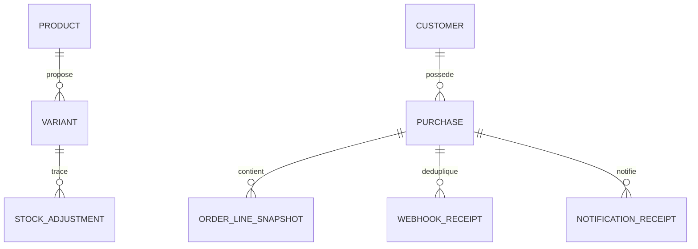

# Modèle métier

`Product` : UUID v7, slug unique, identité, catégorie, état, descriptions, caractéristiques structurées, images et dates. `Variant` : UUID, SKU unique, prix entier en centimes, devise EUR, poids, état et quantités physiques/réservées.

`Customer` implémente les interfaces Symfony User et PasswordAuthenticatedUser. Le hash n’est jamais renvoyé. Panier, adresses et configurations sont des collections JSON privées du compte. Le panier invité est stocké en session.

`Purchase` contient un numéro lisible aléatoire, un propriétaire, l’email, les snapshots d’adresses et de lignes, les montants entiers, l’état commercial, le paiement, la réservation, l’expiration, les références Stripe et l’historique. Les lignes sont des snapshots JSON et ne dépendent pas du nom ou du prix actuel du produit.

`StockAdjustment` conserve avant/après, raison, acteur et date. `WebhookReceipt` a pour clé primaire l’identifiant Stripe de l’événement. `NotificationReceipt` identifie commande + état + canal. Les changements métier ne suppriment pas les commandes et les produits sont archivés.

Invariants : prix ≥ 0 ; physique ≥ réservé ≥ 0 ; disponible = physique − réservé ; total = somme(prix unitaire × quantité) + livraison ; vente ou libération au plus une fois par réservation. PostgreSQL ajoute des CHECK sur le stock et les prix.
