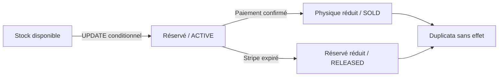

# Stock et réservations

La requête atomique `UPDATE variant SET reserved = reserved + :qty WHERE physical - reserved >= :qty` doit affecter exactement une ligne. Les quantités sont liées comme entiers. Le checkout verrouille les références dans l’ordre des UUID pour limiter les interblocages ; la réservation et les snapshots sont dans la même transaction.

Le webhook verrouille la commande. `reservationStatus` interdit une deuxième vente ou libération, et la clé primaire du reçu interdit le retraitement du même événement. Les ajustements administratifs ne peuvent pas réduire le physique sous le réservé ; leur journal est écrit dans la même transaction.

La réservation expire au bout d’environ 35 minutes. `app:reservations:expire` publie une tâche Messenger ; le handler traite au plus 100 commandes par lot. Une session Stripe terminée reste réservée dans l’attente du webhook. Si Stripe est inaccessible, le traitement échoue et sera retenté. L’absence d’ID local déclenche une recherche Stripe avant toute libération.

Le test PostgreSQL lance deux processus indépendants en compétition pour une unité. Il est ignoré sur SQLite : un test séquentiel réussi ne constitue pas une preuve de concurrence. La CI cible PostgreSQL 17.

Limites : commandes contenant au maximum 50 références et dix unités par référence ; réservations liées aux lignes JSON de commande ; aucun moteur de réapprovisionnement ou gestion multi-entrepôt. Une réconciliation opérateur reste nécessaire après des événements contradictoires ou des pannes prolongées.
