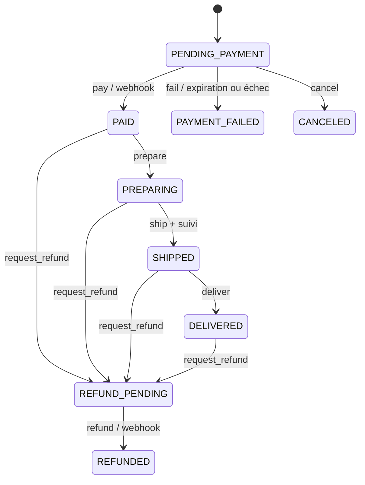

# Workflow des commandes

Symfony Workflow est la source des transitions autorisées. Les contrôleurs administratifs exposent uniquement préparer, expédier et livrer ; ils ne permettent pas de marquer une commande payée. L’expédition exige un numéro de suivi.

Une transition interdite produit `TRANSITION_INVALID` avec HTTP 409. L’acteur, l’heure et l’état cible sont ajoutés à l’historique. Les états de paiement et de réservation sont indépendants : par exemple, un remboursement ne signifie pas que les marchandises sont revenues physiquement en stock.

`DRAFT` et `CANCELED` sont prévus dans le workflow mais ne disposent pas encore d’un parcours public d’annulation. La version actuelle crée directement `PENDING_PAYMENT` lors du checkout.
