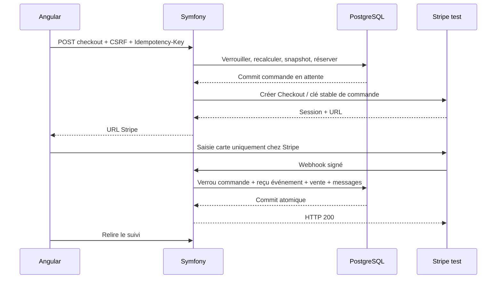

# Paiement Stripe test

Le total client est ignoré. Les clés `sk_live_` sont refusées et les événements `livemode=true` rejetés. La vérification Stripe porte sur le corps HTTP brut, la signature et sa fenêtre temporelle. Un identifiant d’événement déjà traité rend le traitement sans effet.

Le succès doit correspondre à la session, à la devise et au montant de la commande. Une expiration reçue après un succès ne défait pas la vente. Un succès après libération ou un remboursement reçu dans un état incompatible provoque une erreur de rapprochement, plutôt qu’une mutation aveugle.

La création réseau intervient après commit de la réservation. Les tentatives répétées utilisent les mêmes paramètres de snapshot et la même clé Stripe. Le worker d’expiration retrouve une session par métadonnée si son ID local a été perdu, et ne libère pas un paiement terminé. Une panne Stripe retarde la libération.

Le remboursement total est initié par un administrateur, avec une clé stable par commande. Le statut reste `REFUND_PENDING` jusqu’au webhook réussi. Aucun remboursement partiel, annulation automatique de remboursement échoué ou retour logistique automatique n’est encore proposé.

Le retour navigateur affiche une attente : il ne prouve jamais le paiement. Les tests unitaires construisent des événements contrôlés, sans appel financier. Le vrai parcours Stripe Checkout doit être validé séparément avec Stripe CLI et des clés de test.

Référence : [API Stripe Checkout](https://docs.stripe.com/api/checkout/sessions/create).
